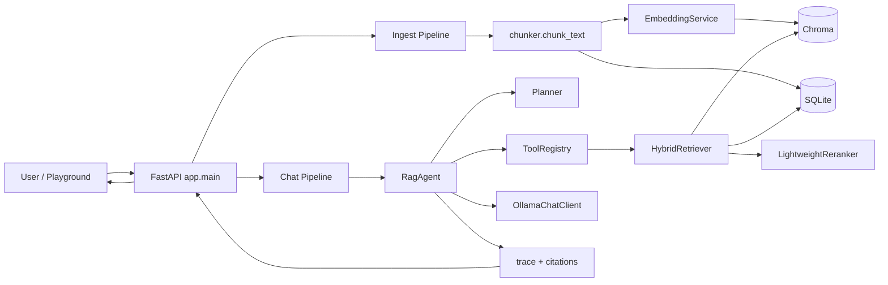
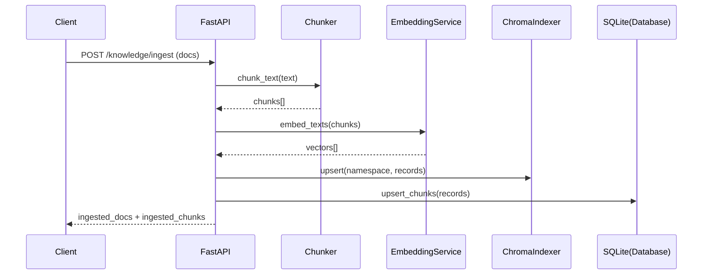
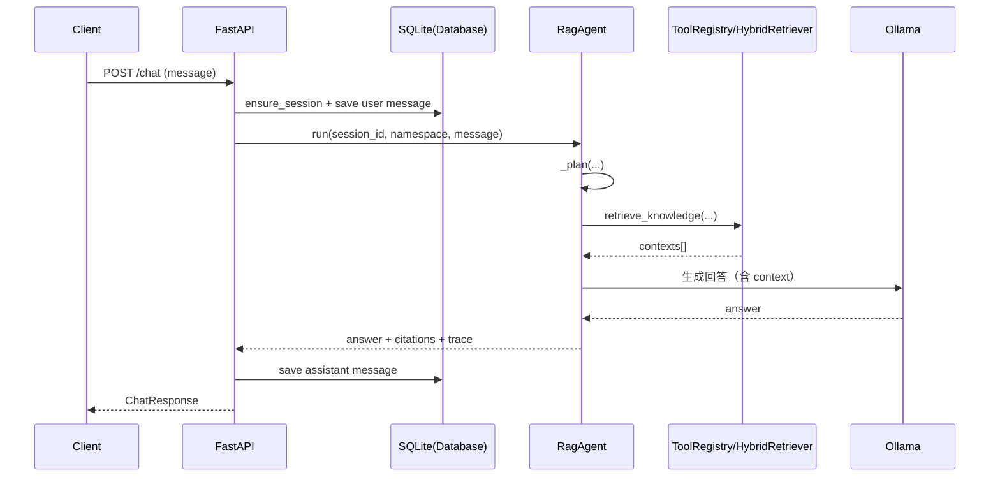

# 架构说明（新手可读版）

## 1. 先用一句话理解这个项目

这是一个本地优先的 RAG + Agent 服务：
- 知识先入库（切块 + 向量化 + 持久化）
- 问题来了先检索（向量 + BM25 + 融合 + 重排）
- 再由 Agent 组织回答，并附带引用与调试轨迹

相关文档：
- 快速运行与命令入口： [README.md](README.md)
- 面试演示流程： [docs/INTERVIEW_PLAYBOOK.md](docs/INTERVIEW_PLAYBOOK.md)

## 2. 全局架构图

## 3. 目录到职责映射

| 模块 | 主要职责 | 关键文件 |
|---|---|---|
| API 层 | 定义 HTTP 接口、组织请求流程 | `app/main.py`, `app/api/schemas.py` |
| 配置与基础设施 | 环境配置、日志、数据库、指标 | `app/core/config.py`, `app/core/database.py`, `app/core/logging.py`, `app/core/observability.py` |
| RAG 入库链路 | 文档解析、切块、向量化、索引 | `app/rag/document_parser.py`, `app/rag/chunker.py`, `app/rag/embedding.py`, `app/rag/indexer.py` |
| RAG 检索链路 | 向量检索 + BM25 + RRF + 重排 | `app/rag/retriever.py`, `app/rag/reranker.py` |
| Agent 编排层 | planner、工具调用、回答生成 | `app/agent/orchestrator.py`, `app/agent/tools.py` |
| 运行与评测脚本 | 入库演示、评测、面试流程 | `scripts/*.py` |

## 4. 两条最重要的请求时序

### 4.1 知识入库时序（/api/v1/knowledge/ingest）

### 4.2 聊天问答时序（/api/v1/chat）

## 5. 数据存储说明

### 5.1 Chroma（向量库）

- 保存每个 chunk 的向量、文本和元数据
- 按 namespace 划分 collection
- 主要用于语义召回

### 5.2 SQLite（业务元数据）

- `sessions`: 会话基础信息
- `messages`: 对话消息、引用、trace
- `user_profile`: 用户画像 key-value
- `chunks`: 文本分块副本（供 BM25 与统计）
- `agent_config`: namespace 级助手配置

## 6. 检索策略为什么是“混合”

- 向量检索擅长语义相似，但可能漏掉关键词强匹配。
- BM25 擅长关键词匹配，但语义泛化较弱。
- RRF 把两路结果按名次融合，稳定性更高。
- 轻量重排再结合覆盖率和多路分数，提升 top-k 质量。

## 7. 模型不可用时的降级逻辑

- Embedding 失败：回退到哈希向量，保证检索流程可运行。
- Chat 模型失败：返回可识别前缀，上层给出可读的兜底回答。
- 目标是“服务不中断”，即使回答质量下降也能完成演示。

## 8. 你可以按这个顺序读代码

1. `app/main.py`
2. `app/agent/orchestrator.py`
3. `app/rag/retriever.py`
4. `app/rag/indexer.py` + `app/rag/embedding.py`
5. `app/core/database.py`

这样阅读可以从“请求入口”一路追到“检索和生成细节”。

## 9. 面试演示常用 API

- `POST /api/v1/knowledge/ingest`
- `POST /api/v1/knowledge/upload`
- `POST /api/v1/retrieve`
- `POST /api/v1/chat`
- `GET /api/v1/demo/summary`
- `GET|PUT|DELETE /api/v1/agent-config`
- `GET /api/v1/metrics`
- `GET /playground`
